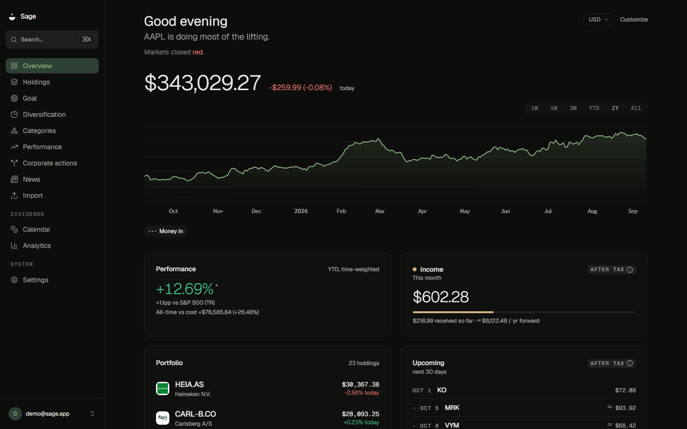
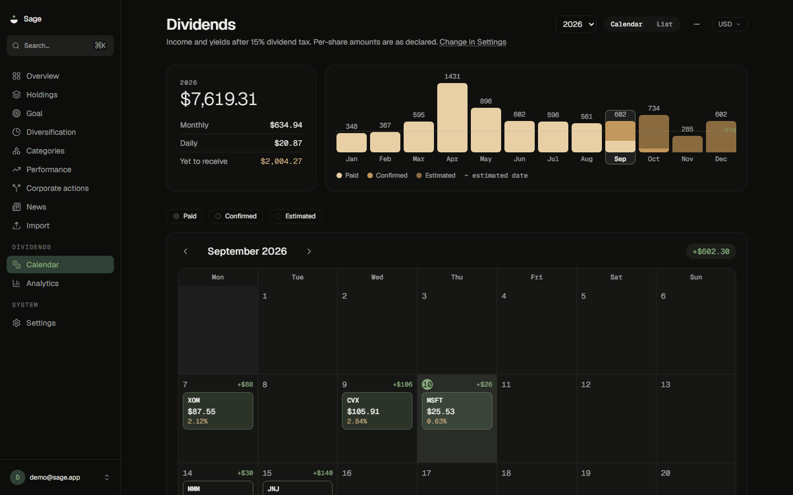
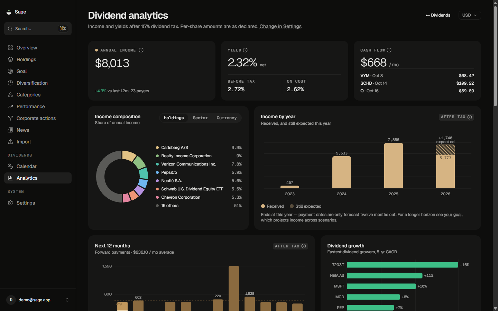
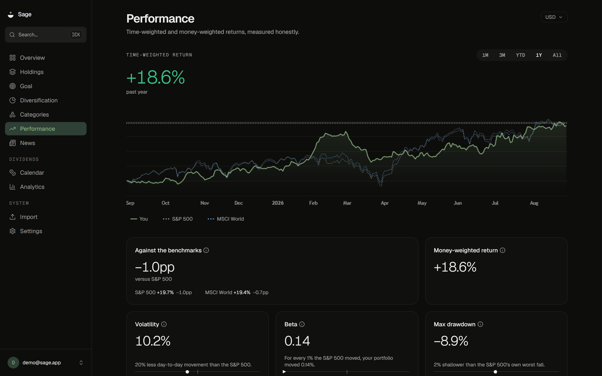
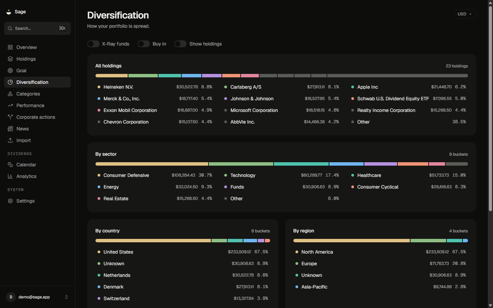
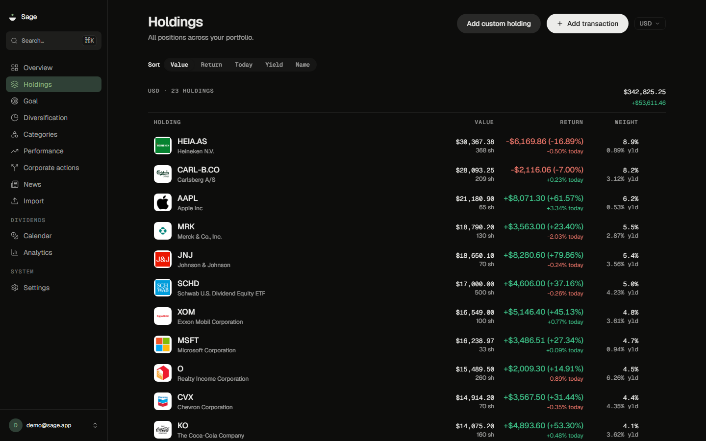
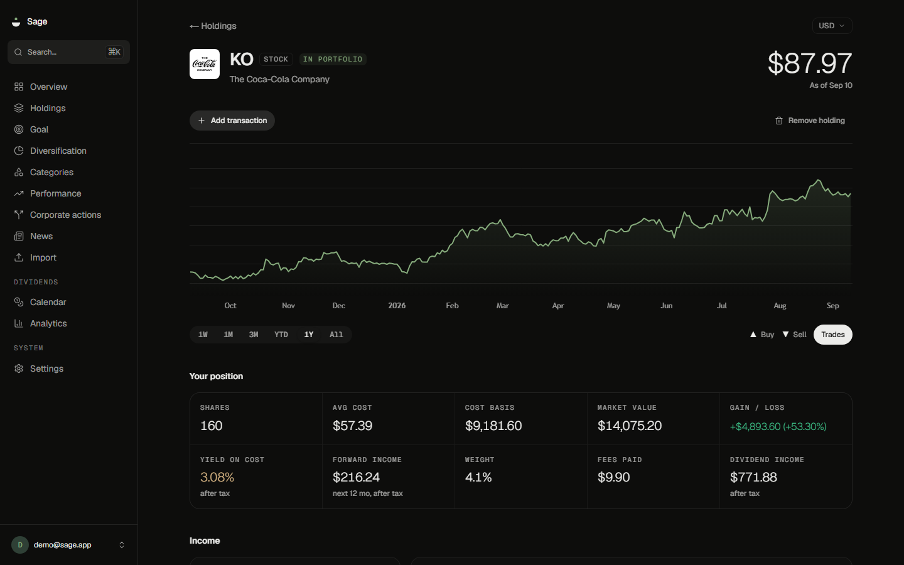
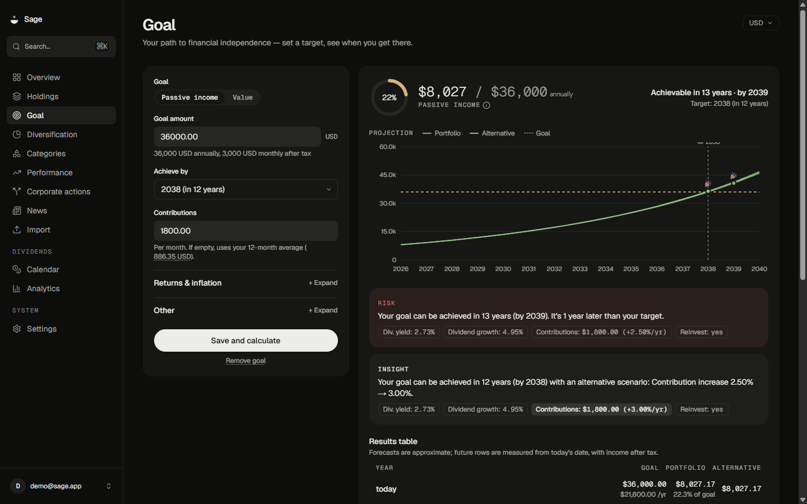
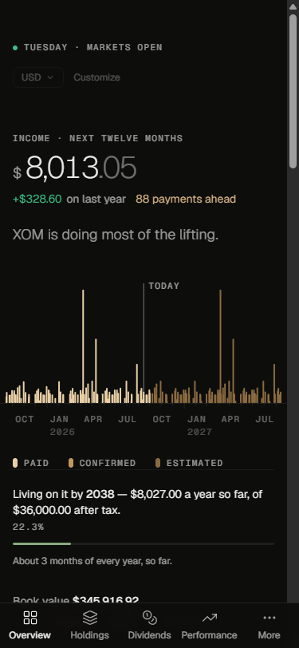
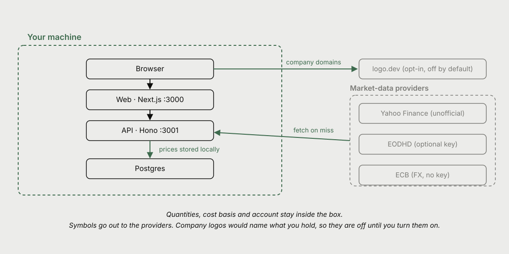

<p align="center">
  <picture>
    <source media="(prefers-color-scheme: dark)" srcset="docs/assets/banner-dark.svg">
    
  </picture>
</p>

[](https://github.com/bjarkeef/sage/actions/workflows/ci.yml)
[](https://github.com/bjarkeef/sage/actions/workflows/self-host-smoke.yml)
[](./LICENSE)
[](./docs/DEPLOYMENT.md)
[](./CONTRIBUTING.md)
[](./CHANGELOG.md)

Sage is an open-source, self-hostable dividend and investment portfolio
tracker. You run it on your own machine, so tracking your holdings, your
dividend income and your performance doesn't mean handing your financial life
to somebody else's SaaS.

**Status:** public beta — `v1.0.0-beta.1`. Portfolio, dividends, performance,
diversification, categories and custom holdings are all built and in daily use
on the maintainer's own instance. Beta means the shape is settled and the
arithmetic is tested, not that nothing will change: read
[`docs/MARKET-DATA.md`](./docs/MARKET-DATA.md) before you rely on it, because
the default price source is an unofficial one that can break without warning.

<p align="center">
  
</p>

## What you get

### Dividends

Sage starts with dividends, and so does its front page. A dividend account
isn't run for its net worth, so the overview leads with what the book pays over
the next twelve months, over a stream of every payment it has made and expects
— solid where the money has landed, lighter where the payment is merely
declared, lighter still where Sage is forecasting it. Your balance is on that
page too, as a supporting figure, which is the job it actually does here.

The calendar shows one year at a time, with
payments you've already received and predicted ones in the same grid. The year
picker, the bars and the list all follow a single selection, so the three
layers can't disagree about which year is on screen. A total that would span
more than one currency renders as `—` instead of a figure that's wrong in
every currency you might read it as.

<p align="center">
  
</p>

The analytics page turns the same ledger into a forward twelve-month run rate,
per-payer and per-month breakdowns, and dividend growth rates. Positions
you've since sold stay in the history, because income you actually received
shouldn't disappear just because you exited.

<p align="center">
  
</p>

### Performance

Time-weighted return, chained daily over the range you pick, and annualized
once that range is longer than a year — so a deposit made in the middle of a
good month doesn't read as skill. Then volatility, maximum drawdown, best and
worst day, and a benchmark line to measure against. Benchmarks are total-return
series, not price indices, so the comparison isn't quietly flattered by the
dividends the index paid. Prices are read from your own Postgres, so the chart
is exactly as long as the history you have stored.

<p align="center">
  
</p>

### Diversification

Weights by sector, country, asset class and currency, on either market value
or what you paid. An X-Ray toggle looks through funds and ETFs to their
underlying holdings instead of counting each fund as one line. Whatever Sage
can't classify goes into an `Unknown` bucket in plain sight, rather than being
spread across the ones it can.

<p align="center">
  
</p>

### Holdings

One row per position, with its daily change, total return and share of the
book, sortable in place. Instruments no provider covers can be entered as
custom holdings and priced by you, so a book with something unlisted in it
still adds up.

<p align="center">
  
</p>

### Getting your book in

Export a CSV from your broker and drop it on the import page. Sage reads the
header row and guesses which column is the symbol, the quantity, the price, the
date, the currency and the fee; you correct anything it got wrong, see the
parsed rows before committing, and rows it cannot read are listed with a reason
rather than skipped silently.

Broker exports are not written for machines, so the reader is forgiving about
how numbers are written. `$1,241.30`, `1.241,30`, `1 241,30` and `1'241.30` all
read as the same number, and a quantity written as `-45` on a sell keeps its
meaning from the type column. Dates that could be read two ways are flagged
rather than guessed at.

Your broker's word for what happened gets matched too — "Cash Dividend" is a
dividend, "SELL - MARKET" is a sell. Anything left over is listed on the mapping
step with a dropdown, so a value like "Reinvest Shares" is yours to place rather
than something to go and edit the file over. If your file has no currency
column, set one default for the whole thing.

Two conventions worth knowing: a dividend row's price is the amount **per
share**, and a split row's quantity is the **ratio** — 2 for a two-for-one, 0.5
for a one-for-two reverse split.

Re-importing an overlapping file is safe, because every row carries a hash and
the ones already recorded are recognised as duplicates. Snowball Analytics
exports have their own reader.

You can also add holdings one at a time, which is the faster path for a handful
of positions.

### And the rest

A page per instrument, with profile, fundamentals, dividend history, news and
analyst ratings. A goal page that runs your own assumptions forward and says
plainly that the result is arithmetic applied to your inputs, not a forecast.

<p align="center">
  
</p>

<p align="center">
  
</p>

It works on a phone and installs to your home screen. There's deliberately no
offline cache, because stale figures are worse than none in an app whose whole
value is that its numbers are current.

<p align="center">
  
</p>

## Quick start

### Self-host with Docker Compose

```bash
cp .env.example .env
# set BETTER_AUTH_SECRET (and provider keys if needed)
docker compose up -d --build
```

Then create your account in the UI and set `ALLOW_SIGNUP=false` to keep the
instance to yourself. Details: [`docs/DEPLOYMENT.md`](./docs/DEPLOYMENT.md).

Forgotten your password? Sage sends no email, so recovery runs from a shell:
`docker compose exec -it api sage reset-password`. See
[account recovery](./docs/DEPLOYMENT.md#account-recovery).

### Development

```bash
corepack enable   # use the pinned pnpm version
pnpm install

# API env (required for auth)
cp apps/api/.env.example apps/api/.env
# set BETTER_AUTH_SECRET to a long random string

pnpm dev          # starts Postgres (docker) + API + web
pnpm check        # lint + typecheck + format check
pnpm test         # unit + integration (testcontainers for DB)
```

- Web: http://localhost:3000
- API: http://localhost:3001

## How it works

<p align="center">
  <picture>
    <source media="(prefers-color-scheme: dark)" srcset="docs/assets/architecture-dark.svg">
    
  </picture>
</p>

The web app, the API and Postgres come up together on your machine under one
`docker compose up`. There is no Sage server, so your quantities, cost basis,
transactions and account never leave that box. A few kinds of request do leave
it, and it's worth knowing exactly which.

**Symbols and date ranges go to a market-data provider.** The API sends a
ticker and asks for a quote, a range of daily bars, a dividend history or a
company profile, and a price comes back. Nothing about your position travels
with it, since the provider can't tell one share from a thousand. The ECB is
sent nothing at all: Sage downloads whole reference-rate files and picks what
it needs locally.

**Company logos would name what you hold, so they are off.** Fetching a logo
means asking a third party for a named company, from your browser, at your
address; do that for every row and the requests are your holdings list. Sage
draws ticker initials instead, and asks nobody. Setting
`NEXT_PUBLIC_LOGO_DEV_TOKEN` turns real logos on through `img.logo.dev`, which
is a deliberate trade rather than a default:
[`.env.example`](./.env.example) says what it discloses. The screenshots above
were taken with it on.

**News thumbnails are off for the same reason.** A story's image lives on the
publisher's server, so loading one is a request from your browser, at your
address, made without you clicking anything — down a feed scoped to what you
own. Sage renders the headlines and skips the pictures.
`NEXT_PUBLIC_NEWS_THUMBNAILS=true` turns them on. Following a headline still
goes to the publisher, but that is a choice you make.

Those two settings are the only things in Sage that can tell a third party what
you hold. With both unset, nothing does.

Prices and ECB reference rates are stored in your database as they arrive,
which is why the app still has something to show when a provider is
unreachable.

## Market data

Sage has no licensed market-data feed. By default it reads prices through an
unofficial Yahoo client: broad coverage, no key, and it can break without
warning. It did on 2026-08-09, when an upstream change blanked every price in
the app. Official providers are supported, but their free tiers are small
enough that most setups still fall back to the unofficial path. Prices are
stored in your own Postgres, so an outage leaves you with the last known
values and a notice, not an empty app.

**Read [`docs/MARKET-DATA.md`](./docs/MARKET-DATA.md) before you rely on it.**

## Your data

Your data stays yours. **Settings → Your data** exports your transactions as
CSV or everything you've entered as JSON, at any time, with no provider calls
involved. For disaster recovery, see the database dump instructions in
[`docs/DEPLOYMENT.md`](./docs/DEPLOYMENT.md).

## Disclaimer

Sage is a record-keeping and measurement tool. It does not tell you what to
buy, sell, or hold, and nothing it displays is a recommendation. Figures come
from third-party providers and may be stale, delayed, or missing, so
reconcile against your broker before acting on anything here.

**It is not financial, investment, tax, or legal advice.** Full text:
[`docs/DISCLAIMER.md`](./docs/DISCLAIMER.md).

## Acknowledgements

Charts: [TradingView Lightweight Charts](https://github.com/tradingview/lightweight-charts)
for portfolio and performance time series, and [Recharts](https://recharts.org/)
for dividend and goal analytics. Why both stay:
[`docs/CHARTS.md`](./docs/CHARTS.md).

## License

Copyright (C) 2026 Elunor (CVR no. 46462041)

Licensed under [AGPL-3.0-only](./LICENSE): you're free to run, study, modify
and share Sage, and if you host a modified version for other people you have
to publish your changes. External contributions also require a signed
[Contributor License Agreement](./CLA.md). See
[`CONTRIBUTING.md`](./CONTRIBUTING.md) for what that does and why.
